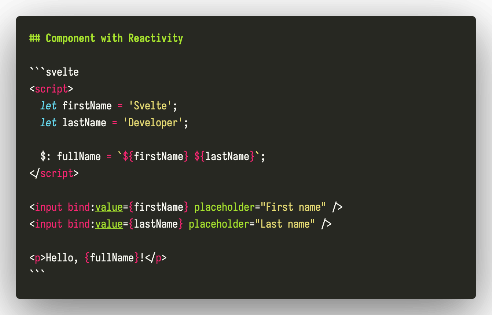

# Markdown Svelte Syntax Highlight

VS Code extension that adds Svelte syntax highlighting in Markdown code blocks.

## Features

- Syntax highlighting for Svelte code blocks in `.md` files
- Syntax highlighting for Svelte code blocks in `.mdx` files
